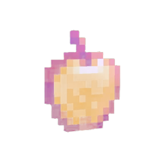

# Notch Apple 🍎✨

> A Minecraft enchanted golden apple that lives in your MacBook's notch. Hover to open the tray, press and hold to eat it. No Dock icon, no menu bar item — the whole app lives in the notch.


## Demo

<p align="center">
  <video src="https://github.com/y-c-shen/NotchApple/raw/main/landing/apple.webm" width="360" autoplay loop muted playsinline>
    <a href="https://notch-apple.vercel.app"></a>
  </video>
</p>

<p align="center"><a href="https://notch-apple.vercel.app"><b>▶ Live demo</b></a></p>

## Modes

Click the button in the tray to cycle modes (your pick is remembered):

| Mode | What it does |
| --- | --- |
| **✦ Particles** *(default)* | Minecraft potion swirls rise across the screen with a golden flash. |
| **⏳ Pomodoro** | Starts a focus timer with a countdown badge in the notch and an "Advancement Made!" toast when it ends. |
| **⛔ Blocker** | Redirects social media (X, Instagram, TikTok, Reddit, YouTube…) to a Minecraft "Connection Lost" screen until you eat the apple again. |

## Install

**Download:** grab `NotchApple.zip` from [Releases](https://github.com/y-c-shen/NotchApple/releases), unzip, drag **Notch Apple.app** to `/Applications`, then right‑click → Open (ad‑hoc signed).

**From source:**

```sh
git clone https://github.com/y-c-shen/NotchApple.git
cd NotchApple
swift run
```

Requires a MacBook **with a notch**, **macOS 13+**, and **Apple Silicon**. Right‑click the tray → Quit to exit.

## License

MIT. A fan‑made toy, **not affiliated with Mojang, Microsoft, or Apple**. [Monocraft](https://github.com/IdreesInc/Monocraft) font by IdreesInc (OFL).
